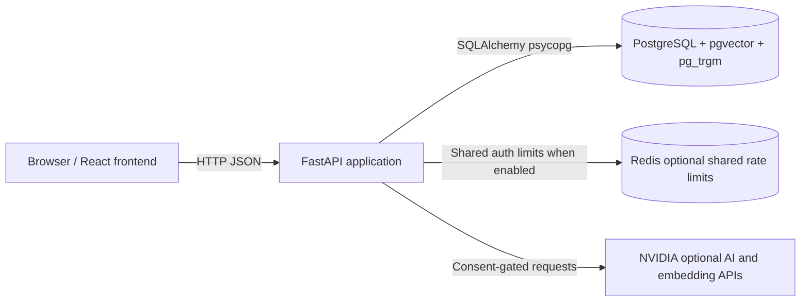
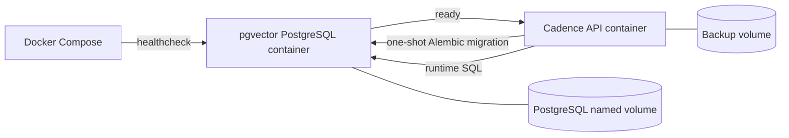
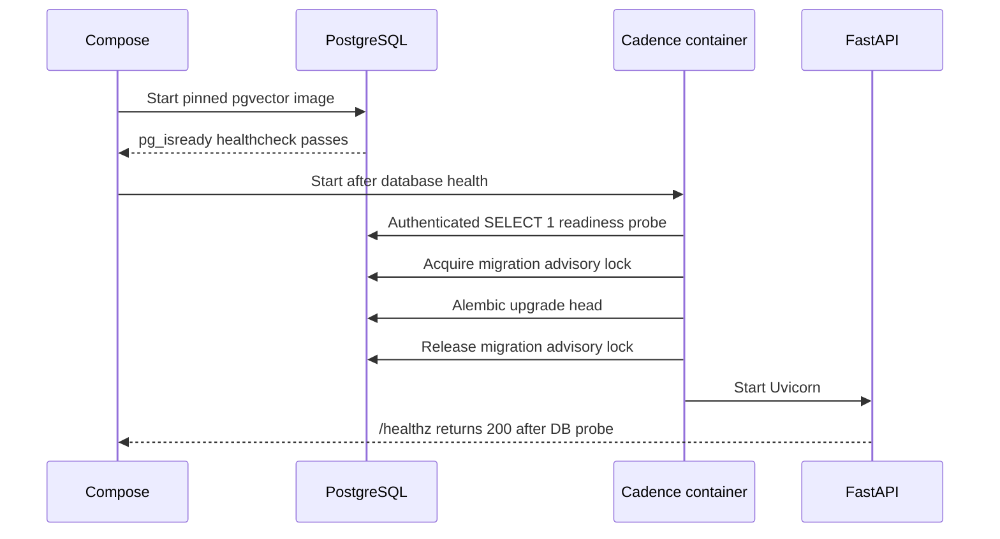
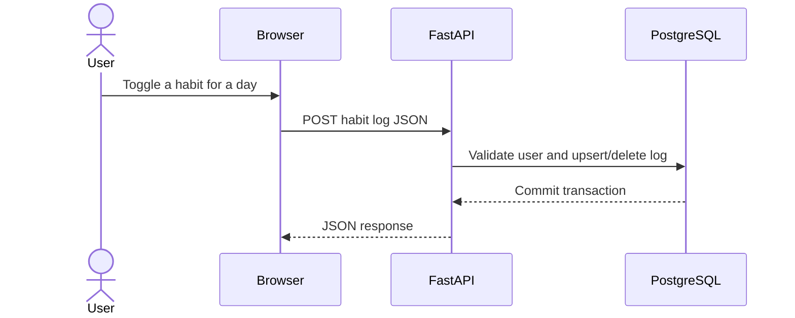
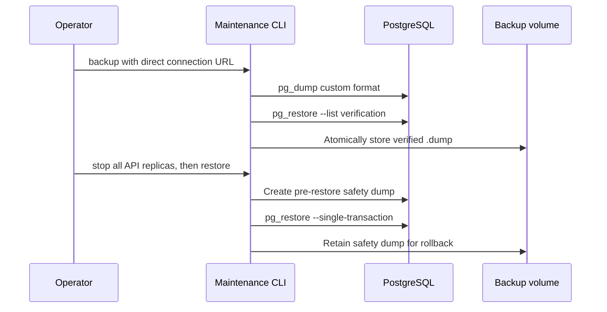

# Cadence Architecture Diagrams

These diagrams describe the current FastAPI, PostgreSQL, pgvector, and pg_trgm
deployment. The browser uses the built frontend or the development server;
the API owns persistence and optional shared rate limiting.

## System architecture

## Local Docker deployment

## Startup and migration flow

## Habit logging flow

## Backup and restore flow

