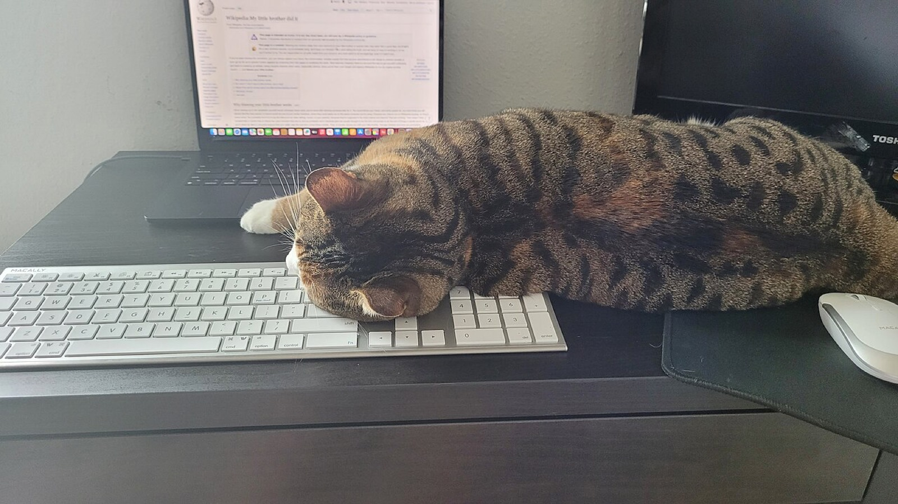

# Cadence

[](https://github.com/FloatingPegasus/Cadence/actions/workflows/ci.yml)

Private habits, an hourly log, and a focus room. Self-hosted. AI reviews stay
off until you consent.



## Try it

```sh
git clone https://github.com/FloatingPegasus/Cadence.git
cd Cadence
./scripts/quickstart.sh
```

Open <http://localhost:8000>, create an account, and check the Compose logs for
the verification link if you have not set Brevo.

## What it does

- Tick habits on Today. Add one from that page.
- Write where each hour went.
- Sit in a timer with lo-fi and a study scene.
- Read the week back in History.

Email verification, PostgreSQL, backups, and production config live in
[Self-hosting](docs/self-host.md).

## Contributing

See [CONTRIBUTING.md](CONTRIBUTING.md), [SECURITY.md](SECURITY.md), and the
[Code of Conduct](CODE_OF_CONDUCT.md). MIT licensed: [LICENSE](LICENSE).

If Cadence is useful, [star it on GitHub](https://github.com/FloatingPegasus/Cadence).
