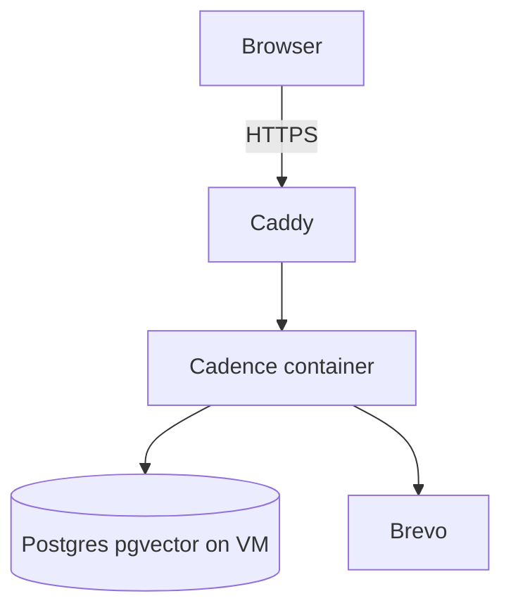

# Always-on deploy (cadence.kanishq.dev)

Run Cadence on one always-on VM: Postgres+pgvector and the app in Compose,
Caddy for HTTPS. No cold starts.

**Now:** one VM, same Compose layout everywhere (Oracle free, cheap VPS, or any
cloud VM). **Later:** split DB and app onto managed services without rewriting
the product. Student credits (Azure, etc.) are optional cash, not the design.

## Architecture



- `compose.yaml` + `compose.prod.yaml`: `db`, `app`, `caddy`
- App serves the built frontend (`CADENCE_SERVE_FRONTEND=true`)
- Caddy terminates TLS for `CADENCE_DOMAIN` and proxies to `app:8000`
- Postgres stays on `127.0.0.1:5432` only
- Cookie sessions stay same-origin (no Vercel split)

## 1. Create the VM

Any Ubuntu 24.04 host with a public IP works. Prefer:

### Oracle Cloud Always Free (preferred $0)

1. Create an Ampere A1 instance (Ubuntu 24.04) within the free pool.
2. VCN ingress: TCP 22, 80, 443 (and UDP 443 for HTTP/3).
3. Note the public IP.

### Cheap always-on VPS (Hetzner, etc.)

Same Ubuntu image and firewall rules. Pay a few euros/month if Oracle signup
is blocked. Layout and scale path are identical.

### Optional: Azure for Students

Only if you already have pack credits and want a VM today. Use a small Linux
VM the same way as Oracle. Do not design around Education Pack offers; they
change and expire (DigitalOcean left the pack in 2026).

## 2. DNS on name.com

For `kanishq.dev`:

| Host | Type | Value |
| --- | --- | --- |
| `cadence` | A | VM IPv4 |
| `cadence` | AAAA | VM IPv6 (optional) |

Remove any old Vercel / parking records for `cadence`. Wait until
`dig +short cadence.kanishq.dev` returns your VM IP.

## 3. Bootstrap the host

```sh
ssh root@YOUR_VM_IP
git clone https://github.com/FloatingPegasus/Cadence.git /opt/cadence
cd /opt/cadence
sudo ./scripts/bootstrap-host.sh
```

If you SSH as a non-root user with sudo, add that user to the `docker` group
and re-login.

## 4. Configure and start

```sh
cd /opt/cadence
cp .env.production.example .env
# Set CADENCE_SECRET_KEY (or let deploy-prod.sh generate it),
# CADENCE_POSTGRES_PASSWORD, CADENCE_BREVO_API_KEY, CADENCE_FROM_EMAIL.
./scripts/deploy-prod.sh
```

Confirm:

```sh
curl -fsS https://cadence.kanishq.dev/healthz
```

Register once in the browser (Brevo must accept the from-address).

## 5. Backups

```sh
chmod +x /opt/cadence/scripts/backup-cron.sh
(crontab -l 2>/dev/null; echo "15 3 * * 0 /opt/cadence/scripts/backup-cron.sh") | crontab -
```

Dumps land in the Compose backup volume and are copied to
`/opt/cadence/backups/host/`.

## Updates

```sh
cd /opt/cadence
git pull
./scripts/deploy-prod.sh
```

## Scale later (when the single VM is too small)

Keep `cadence.kanishq.dev`. Change infrastructure under it:

1. **Database:** managed Postgres with `vector` and `pg_trgm` (e.g. Neon always-on
   or similar). Migrate with `pg_dump` / restore. Set
   `CADENCE_DATABASE_URL` (pooled) and `CADENCE_MIGRATION_DATABASE_URL` (direct).
2. **App:** run the same Docker image on Fly (or similar) with
   `min_machines_running=1` so there is no idle sleep. Drop the on-box `db`
   service.
3. **Edge:** keep Caddy or the platform TLS; point DNS A/AAAA at the new app.
4. **Workers:** when you run more than one process, set
   `CADENCE_AUTH_RATE_LIMIT_BACKEND=redis` and `CADENCE_REDIS_URL`.

That path is the long-term design. The single VM is only stage one.
